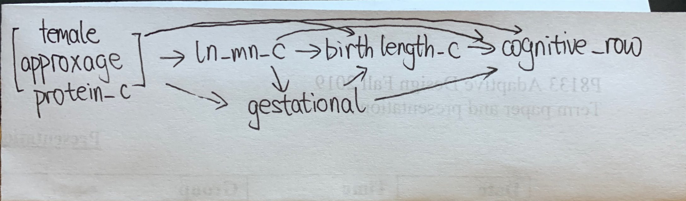

```{r setup, include=FALSE}
knitr::opts_chunk$set(echo = FALSE)
```

```{r,message=FALSE}
library(tidyverse)
library(survey)
```

## Part 1

```{r}
# Part 1
data1 = read.csv("./data1_final.csv") %>% 
  mutate(female = as.factor(female))
```

### Question 1a


### Question 1b

```{r}
# Question 1b
exp_q = quantile(data1$ln_mn_c, c(0.25, 0.75))
exp_q
```

Regress Y on A and C:

```{r}
exp.model = lm(cognitive_raw~ln_mn_c+female+approxage+protein_c, data = data1)
summary(exp.model)
```

Regress Y on A, M and C:

```{r}
med.model = lm(cognitive_raw~ln_mn_c+birthlength_c+female+approxage+protein_c, data = data1)
summary(med.model)
```

Regress M on A and C

```{r}
MA.model = lm(birthlength_c~ln_mn_c+female+approxage+protein_c, data = data1)
summary(MA.model)
```

```{r}
phi1 = -0.65445
theta1 = -0.35228
theta2 = 0.86369
beta1 = -0.349862
dif_ind = phi1-theta1
prd_ind = theta2*beta1
exp_chg = exp_q[2]-exp_q[1]
```

The total effect of one unit change in log and centered manganese level is `r round(phi1,3)` and the total effect of a change in log and centered manganese levels from 25th to the 75th percentile is `r round(phi1*exp_chg,3)`.

The direct effect of one unit change in log and centered manganese level is `r round(theta1,3)` and the direct effect of a change in log and centered manganese levels from 25th to the 75th percentile is `r round(theta1*exp_chg,3)`.

The indirect effect of difference method for one unit change in log and centered manganese level is `r round(dif_ind,3)` and the indirect effect of difference method for a change in log and centered manganese levels from 25th to the 75th percentile is `r round(dif_ind*exp_chg,3)`.

The indirect effect of product method for one unit change in log and centered manganese level is `r round(prd_ind,3)` and the indirect effect of product method for a change in log and centered manganese levels from 25th to the 75th percentile is `r round(prd_ind,3)*exp_chg`.

### Question 1c

The model including interaction

```{r}
# Question 1c
int.model = lm(cognitive_raw~ln_mn_c+birthlength_c+ln_mn_c*birthlength_c+female+approxage+protein_c, data = data1)
summary(int.model)
CIL = 0.277-1.96*0.12
CIU = 0.277+1.96*0.12
```

The estimator for the interaction between the manganese exposure and birth length in a linear regression adjusted for the covariates is 0.277. The 95% confidence interval is (`r round(CIL,3)`, `r round(CIU,3)`).

### Question 1d

If we believe there is interaction between the manganese exposure and birth length and include interaction term in our model, then the product and difference method estimators are not valid in this context as it is unclear how to handle the interaction coefficient and two methods provide different results. If we believe there is no interaction between the manganese exposure and birth length and there is no need to include interaction term in our model, then two estimators are valid.

### Question 2a


Identifiability assumptions:

(i) No unmeasured exposure-outcome confounding given C

(ii) No unmeasured mediator-outcome confounding given C

(iii) No unmeasured exposure-mediator confounding given C

(iv) No effect of exposure that confounds the mediator-outcome relationship

To estimate natural direct and indirect effects, we need above four assumptions. To estimate the controlled direct effect conditional on the covariates, we need assumption 1 and 2. As there are unmeasured confounder SES, assumptions 1,2 and 3 are violated, thus natural direct effect, natural indirect effect and controlled direct effects cannot be identified.

### Question 2b

Hypothesize: The direction of SES effect on exposure is negative. The direction of SES effect on mediator is positive. The direction of SES effect on outcome is positive. 

As the direction of SES effect on exposure is negative and the direction of SES effect on outcome is positive, the direction of confounding bias for total effects is negative. As the direction of SES effect on mediator is positive, the direction of confounding bias for indirect effects is positive. Thus, the direction of confounding bias for direct effects is negative.

### Question 3a



### Question 3b

The natural direct and indirect effects are identified in the DAG, becuase following assumptions are not violated.

(i) No unmeasured exposure-outcome confounding given C

(ii) No unmeasured mediator-outcome confounding given C

(iii) No unmeasured exposure-mediator confounding given C

(iv) No effect of exposure that confounds the mediator-outcome relationship

### Question 3c

$E[Y|A=a,C=c]=\phi_0+\phi_1ln\_mn\_c+\phi_2female+\phi_3approxage+\phi_4protein\_c$
$E[Y|A=a,C=c,M=m_1]=\theta_0+\theta_1ln\_mn\_c+\theta_2birthlenghth\_c+\theta_3gestational\_age+\theta_4female+\theta_5approxage+\theta_6protein\_c$

Then, direct effect is $\theta_1$, indirect effect is $\phi_1-\theta_1$.

## Part 2

```{r}
# Part 2
data2 = read.csv("./data2_final.csv")
```

### Question 1

1. Time point 0: L1, L2, L3, A
2. Time point 1: L1, L2, A
3. Time point 2: Y

### Question 2


### Question 3

The causal contrast $E[Y_{11}-Y_{00}]$ means the causal effect comparing $A_0 = A_1 = 1$ to $A_0 = A_1 = 0$.

### Question 4

In order to identify the causal contrast of interest, we need to know direct effect and indirect effec, thus following no unmeasured confounding assumptions need to hold:

1) exchangability, positivity, consistency and SUTVA.
2) At baseline: $Y\perp A_0|L_3$. At time point 1: $Y\perp A_0|[L_{10},L_{20},L_3,A_0]$
3) No unmeasured exposure-outcome confounding given C
4) No unmeasured mediator-outcome confounding given C
5) No unmeasured exposure-mediator confounding given C
6) No effect of exposure that confounds the mediator-outcome relationship

### Question 5

As we are interested in the treatment effect of overall treatment process influenced by both treatmengt at baseline and time point 1, I choose following marginal model:

$$E[Y_{a0a1}] = \beta + \beta_0A_0 + \beta_1A_1$$

Then causal contrast $E[Y_{11}-Y_{00}]$ equals to $\beta_0+\beta_1$. Using bootstrap, we can get estimates and 95% confidence interval as following:

```{r}
# create wide data
AC_data = data2 %>%
 gather(key = "Lt", value = "value", c(L1,L2,A)) %>%
 arrange(id) %>%
 mutate(Lt = str_c(Lt, t0)) %>%
 select(id, Lt, value) %>%
 spread(key = Lt, value = value)
Y_data = data2 %>%
 select(id, Y) %>%
 na.omit()
L3_data = data2 %>% 
  select(id,L3) %>% 
  na.omit()
wide_data = merge(merge(AC_data, Y_data),L3_data) %>% 
  select(-c(A2,L12,L22))
```

```{r}
set.seed(123)
nboots = 1000
n_sample = nrow(wide_data)
beta = rep(NA, nboots)
beta0 = rep(NA, nboots)
beta1 = rep(NA, nboots)
CauEff = rep(NA, nboots)
for (i in 1:nboots) {
  S.b <- sample(1:n_sample, size = n_sample, replace = TRUE)
  data.b <- wide_data[S.b, ]
  # Time point 0
  glm.model0 = glm(A0~L3, data = data.b, family = binomial)
  p0 = predict(glm.model0, type = "response")
  w0 = ifelse(data.b$A0==1, 1/p0, 1/(1-p0))
  # Time point 1
  glm.model1 = glm(A1~L3+A0+L10+L20, data = data.b, family = binomial)
  p1 = predict(glm.model1, type = "response")
  w1 = ifelse(data.b$A1==1, 1/p1, 1/(1-p1))
  w = w0*w1
  
  data.b$w = w
  design = svydesign(ids = ~id, weights = ~w, data = data.b)
  msm = svyglm(Y ~ A0 + A1, family = gaussian(link = "identity"), design = design)
  beta[i] = msm$coef[1]
  beta0[i] = msm$coef[2]
  beta1[i] = msm$coef[3]
  CauEff[i] = msm$coef[2] + msm$coef[3]
}
```

```{r}
Estimate = c(mean(beta), mean(beta0), mean(beta1), mean(CauEff)) %>% round(4)
CI = rbind(quantile(beta, probs = c(0.025, 0.975)),
           quantile(beta0, probs = c(0.025, 0.975)),
           quantile(beta1, probs = c(0.025, 0.975)),
           quantile(CauEff, probs = c(0.025, 0.975))) %>% round(4) 
name = c("beta", "beta0", "beta1", "Causal Contrast")
cbind(name, Estimate, CI) %>% 
  as.data.frame() %>% 
  mutate(CIL = `2.5%`,
         CIU = `97.5%`) %>% 
  select(name, Estimate, CIL, CIU) %>% 
  knitr::kable()
```

So the estimate of causal contrast $E[Y_{11}-Y_{00}]$ is `r Estimate[4]`, the 95% confidence interval is (`r CI[4,1]`, `r CI[4,2]`).

### Question 6

The causal contrast $E[Y_{11}-Y_{00}]$ means the causal effect comparing $A_0=1, A_1 = 0$ to $A_0=0, A_1=0$.

### Question 7

In order to identify the causal contrast of interest, we need to know direct effect and indirect effec, thus following no unmeasured confounding assumptions need to hold:

1) exchangability, positivity, consistency and SUTVA.
2) At baseline: $Y\perp A_0|L_3$. At time point 1: $Y\perp A_0|[L_{10},L_{20},L_3,A_0]$
3) No unmeasured exposure-outcome confounding given C
4) No unmeasured mediator-outcome confounding given C
5) No unmeasured exposure-mediator confounding given C
6) No effect of exposure that confounds the mediator-outcome relationship

### Question 8

As we are interested in the treatment effect of overall treatment process influenced by both treatmengt at baseline and time point 1, I still choose following marginal model:

$$E[Y_{a0a1}] = \beta + \beta_0A_0 + \beta_1A_1$$

Then causal contrast $E[Y_{10}-Y_{00}]$ equals to $\beta_0$. According to bootstrap results, we can get the estimate of causal contrast $E[Y_{10}-Y_{00}]$ is `r Estimate[2]`, the 95% confidence interval is (`r CI[2,1]`, `r CI[2,2]`).

### Question 9

If we treat $A_1$ as mediator, than $M_0$ means the value of mediator given exposure is control which means $A_0=0$. And $M_1$ means the value of mediator given exposure is treatment which means $A_0=1$. The natural direct effect is $E[Y_{1M_0}-Y_{0M_0}]$ and the natural indirect effect is $E[Y_{1M_1}-Y_{1M_0}]$.

As we already have the information of $L_1,L_2,L_3$. If we assume following assumptions hold, which means the DAG in question 1 is valid, then these causal effects are identified.

(i) No unmeasured exposure-outcome confounding given C

(ii) No unmeasured mediator-outcome confounding given C

(iii) No unmeasured exposure-mediator confounding given C

(iv) No effect of exposure that confounds the mediator-outcome relationship

**Appendix**

```{r, ref.label=knitr::all_labels(),echo=TRUE,eval=FALSE}
```
